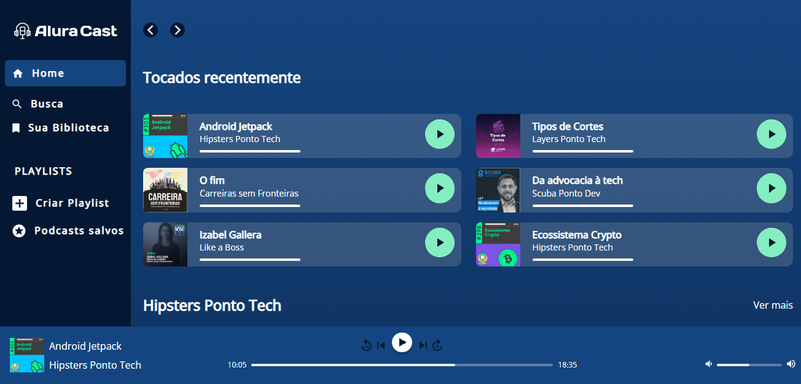

<h1 align="center">
📚 CSS-Grid 
Curso na Alura - CSS: construindo layouts com Grid
</h1>

## 🔨 Funcionalidades do projeto

 Esse projeto utiliza das principais caracteristicas de um layout baseado em grid

